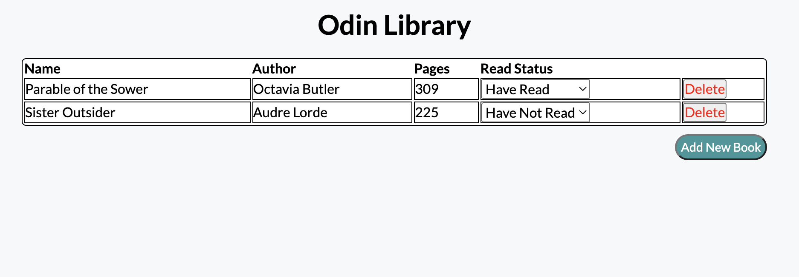

# library
Library built using HTML, CSS, JavaScript

Live Site: [Library](https://kaykaym01.github.io/library/)

[The Odin Project: Library](https://www.theodinproject.com/lessons/node-path-javascript-library)

Site Screenshot: 

This project is an imitation Library made with HTML/CSS/JavaScript. 

Users can:
* Add and delete books from the library
* Mark books as read and not read

